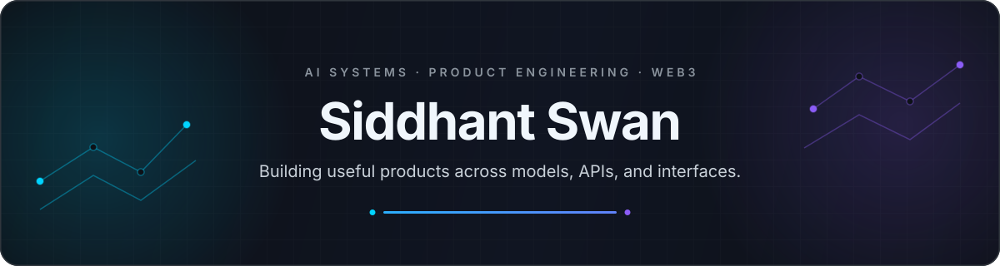

 

**B.Tech ECE · VIT Pune · 8.31 GPA · Class of 2026**

---

## About

I build AI products end to end—from retrieval and model orchestration to APIs, interfaces, and deployment. My focus is **production GenAI**, **low-latency Python systems**, and product engineering that turns capable models into useful software.

| 6+ systems shipped | <300 ms RAG latency | 4 internships | 1 AIP publication |
|:---:|:---:|:---:|:---:|

> **My standard:** the model is only one layer. The product has to work around it.

## Featured systems

<table>
<tr>
<td width="50%" valign="top">

### Athena.AI

**Multi-domain RAG assistant**

Routes questions across finance, health, and education knowledge domains with voice input and semantic retrieval.

`90% classification` · `<300 ms latency`

LangChain · FastAPI · pgvector · Gemini · Next.js

</td>
<td width="50%" valign="top">

### [FairWork ↗](https://github.com/SiddhantSwan12/AI_Boomi_fair_work)

**Decentralized freelance marketplace**

Smart-contract escrow, wallet authentication, encrypted messaging, video rooms, and AI-assisted dispute analysis.

`Polygon escrow` · `XMTP messaging`

Solidity · Foundry · Polygon · wagmi · Next.js

</td>
</tr>
<tr>
<td width="50%" valign="top">

### CommunityAI

**Meeting intelligence platform**

Converts speech into structured minutes and action items. Classification tuning reduced manual moderation work.

`90% extraction` · `70% less manual work`

Whisper · FastAPI · Discord API · React

</td>
<td width="50%" valign="top">

### [Quant Analytics ↗](https://github.com/SiddhantSwan12/quant_analytics_application)

**Real-time market analytics**

Streams Binance Futures data and calculates rolling spread, volatility, hedge-ratio, z-score, and stationarity signals.

`Live WebSockets` · `Threshold alerts`

Pandas · Statsmodels · SQLite · Streamlit · Plotly

</td>
</tr>
</table>

<strong>More projects</strong>

 

- **Financial Humanoid Agent** — Multi-channel financial advisor with real-time market analysis.
- **Oil Spill Detection** — Vessel tracking, anomaly detection, and environmental-impact assessment.
- **Road Repair Prioritization** — ML-driven infrastructure scheduling for urban planning.

## Stack

AI & DATA

  

  

PRODUCT

  

  

SYSTEMS & WEB3

  

  

QUANTUM & INDUSTRIAL

  

&nbsp;&nbsp;&nbsp;

&nbsp;&nbsp;&nbsp;

## Experience

| Period | Role | Impact |
|---|---|---|
| **2026** | Python Developer · Enovate IT | Shipped production APIs; refactored 3 endpoints for **20% faster responses** |
| **2025** | SOC Analyst · Geek Solutions | Triaged 80+ alerts weekly; Python automation cut manual work by **35%** |
| **2024** | Consultant · Grant Thornton China | Built a Power BI dashboard and Python/SQL retention analysis |
| **2024** | Automation · Pranshak Tech | Integrated Cognex vision with a Siemens S7-1200 PLC on a production line |

## Research & learning

- **AIP publication** — Solar-Based Green Hydrogen Production, 2024
- **NVIDIA** Deep Learning · **Google** Advanced Quantum Computing
- **IBM** DevOps & Software Engineering · **McKinsey** Forward Program 2026

---

### Building something ambitious?

Open to AI/ML and product-engineering opportunities.

